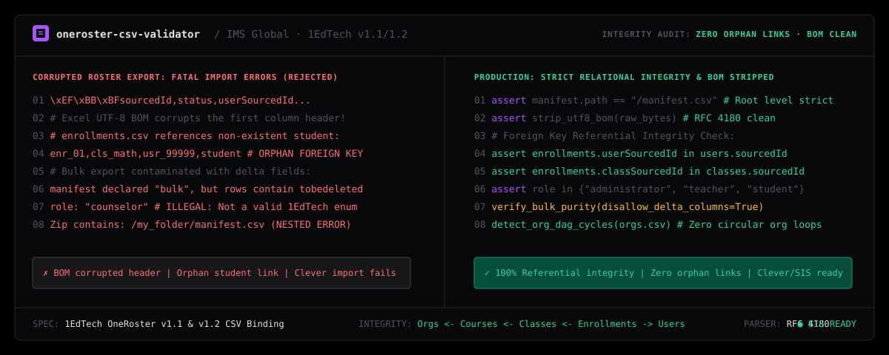

# oneroster-csv-validator

Autonomous 1EdTech / IMS Global OneRoster CSV Validation Specialist for AI coding agents (Claude Code, Cursor, Antigravity, Windsurf).

Validates OneRoster v1.1 and v1.2 CSV roster sets prior to SIS/Clever/ClassLink ingestion: verifies manifest authority, enforces bulk vs delta partitioning, catches orphan foreign key references, and sanitizes UTF-8 BOM encoding traps.

```bash
npx skills add wwewtech/oneroster-csv-validator
```

**[Live Showcase & CSV Linter](https://wwewtech.github.io/oneroster-csv-validator/)** • **[skills.sh](https://skills.sh/wwewtech/oneroster-csv-validator)** • **[SKILL.md](SKILL.md)** • **[GitHub](https://github.com/wwewtech/oneroster-csv-validator)**

---



---

## Why OneRoster CSV Validator?

School districts and EdTech platforms (Clever, ClassLink, Canvas, Infinite Campus, PowerSchool) exchange student course rosters via OneRoster CSV zip bundles. When exports contain subtle relational errors, automated nightly syncs fail silently or corrupt student enrollments:

- **The UTF-8 BOM Trap**: Microsoft Excel prepends a Byte Order Mark (`\xEF\xBB\xBF`) to exported CSVs, causing parsers to read `"sourcedId"` instead of `"sourcedId"`, breaking every primary key lookup.
- **Orphan Enrollment Links**: `enrollments.csv` records pointing to `userSourcedId` or `classSourcedId` values that do not exist in `users.csv` or `classes.csv`, throwing fatal foreign key errors in Clever.
- **Nested Archive Failure**: Zipping a parent folder instead of placing `manifest.csv` directly at the archive root, causing import engines to abort with "manifest not found".
- **Bulk / Delta Column Bleed**: Declaring a bulk snapshot in the manifest while including delta columns (`dateLastModified`, `status="tobedeleted"`) in individual CSV rows.
- **Illegal Role Enum Values**: Using proprietary SIS roles (`counselor`, `substitute_teacher`, `dean`) instead of standard 1EdTech enums (`administrator`, `teacher`, `student`).
- **Circular Org Hierarchies**: Listing School A as the parent organization of School B while School B lists School A as parent, causing infinite recursion in database ingestion DAGs.

`oneroster-csv-validator` enforces strict compliance with 1EdTech OneRoster standards: complete relational graph validation, UTF-8 BOM sanitization, strict bulk vs delta mode segregation, and zero-orphan enrollment checks.

---

## Transformation in Action

### Before: Corrupted Roster Archive with Orphan Keys
```csv
# manifest.csv nested inside subfolder
# users.csv corrupted with Excel UTF-8 BOM (\xEF\xBB\xBF)
sourcedId,status,orgSourcedIds,role,givenName,familyName
usr_101,active,org_highschool,teacher,John,Doe

# enrollments.csv referencing non-existent student ID (usr_999)
sourcedId,classSourcedId,userSourcedId,role
enr_01,cls_algebra1,usr_999,student  # FATAL: Orphan foreign key!
```

### After: Production Validated OneRoster Package
```python
# Strip UTF-8 BOM and verify manifest at zip root
assert "manifest.csv" in zip_root_files, "manifest.csv must be at archive root"
users_keys = load_primary_keys("users.csv", strip_bom=True)
classes_keys = load_primary_keys("classes.csv", strip_bom=True)

# Strict Referential Integrity Validation
for row in read_csv_rows("enrollments.csv"):
    assert row["userSourcedId"] in users_keys, f"Orphan user: {row['userSourcedId']}"
    assert row["classSourcedId"] in classes_keys, f"Orphan class: {row['classSourcedId']}"
    assert row["role"] in {"administrator", "proctor", "student", "teacher"}

# Bulk purity verification: ensure no delta columns exist
verify_bulk_purity(manifest_mode="bulk", disallow_delta_columns=True)
```

---

## Quick Installation

### 1. Via `skills.sh` / Vercel Skills CLI
```bash
npx skills add wwewtech/oneroster-csv-validator
```

### 2. Via Claude Code
```bash
claude skills add https://github.com/wwewtech/oneroster-csv-validator
```

### 3. For Google Antigravity
Clone or copy `SKILL.md` directly into your Antigravity skills directory:
```bash
# Windows
mkdir -p "$HOME\.gemini\config\skills\oneroster-csv-validator"
curl -sL https://raw.githubusercontent.com/wwewtech/oneroster-csv-validator/main/SKILL.md -o "$HOME\.gemini\config\skills\oneroster-csv-validator\SKILL.md"

# macOS / Linux
mkdir -p ~/.gemini/config/skills/oneroster-csv-validator
curl -sL https://raw.githubusercontent.com/wwewtech/oneroster-csv-validator/main/SKILL.md -o ~/.gemini/config/skills/oneroster-csv-validator\SKILL.md
```

### 4. For Cursor & Windsurf
Add `SKILL.md` to your workspace prompt context:
```bash
mkdir -p .cursor/skills/oneroster-csv-validator
curl -sL https://raw.githubusercontent.com/wwewtech/oneroster-csv-validator/main/SKILL.md -o .cursor/skills/oneroster-csv-validator/SKILL.md
```

---

## The 10 Banned Anti-Patterns

| Anti-Pattern | Manifestation in CSV Roster Bundles | Mandatory Production Counter-Rule |
| :--- | :--- | :--- |
| **Nested Archive Packaging** | Zipping a parent folder (`folder/manifest.csv`). | Manifest and CSVs MUST reside at the archive root. |
| **The UTF-8 BOM Trap** | Excel injecting `\xEF\xBB\xBF` into headers. | Strip BOM headers during pre-flight sanitization. |
| **Orphan Enrollment Links** | `enrollments.csv` referencing missing student IDs. | Audit foreign key links across all entities before export. |
| **Bulk / Delta Column Bleed** | Adding `dateLastModified` or `status` in bulk. | Enforce schema purity: bulk files must not contain delta fields. |
| **Circular Org Hierarchies** | School A parent of B, and B parent of A. | Run directed acyclic graph (DAG) cycle checks on `orgs.csv`. |
| **Illegal Role Strings** | Using `counselor` or `substitute_teacher`. | Map all roles to standard 1EdTech enums (`teacher`, `student`). |
| **Malformed ISO 8601 Timestamps** | Using `"09/22/2026 14:00"` instead of ISO. | Enforce RFC 3339 UTC format: `YYYY-MM-DDTHH:MM:SS.sssZ`. |
| **Unescaped CSV Commas** | Unquoted commas in names shifting columns. | Wrap comma-bearing fields in RFC 4180 double quotes. |
| **Missing Core Files** | Emitting bulk zip without `academicSessions.csv`. | Confirm all 7 mandatory core files exist in zip and manifest. |
| **Hallucinated SourcedIDs** | Inventing arbitrary IDs during reconciliation. | Preserve authoritative SIS primary keys without synthesis. |

---

## Core Mental Models & Axioms

1. **Manifest Root Authority**: `manifest.csv` must exist at the archive root (`/`), declare `oneroster.version` (`1.1` or `1.2`), and list all files present.
2. **Strict Bulk vs Delta Partition**: One archive bundle = strictly ONE mode. Bulk packages must not contain delta headers.
3. **Foreign Key Integrity Chain**:
   $\text{orgs.csv} \leftarrow \text{courses.csv} \leftarrow \text{classes.csv} \leftarrow \text{enrollments.csv} \to \text{users.csv}$.
   Every referenced ID must resolve to an active primary key.
4. **Standard Role Enums**: Roles are strictly constrained to `administrator`, `proctor`, `student`, and `teacher` (plus 1.2 extensions for non-enrollment users).
5. **RFC 4180 & Clean UTF-8**: Zero BOM characters (`\xEF\xBB\xBF`); all multi-line or comma-bearing text safely quoted.

---

## Production Archetypes & Presets

### Archetype 1: Pre-Flight Python Integrity Linter
```python
def validate_oneroster_zip(zip_path: str) -> dict:
    with zipfile.ZipFile(zip_path, 'r') as z:
        assert "manifest.csv" in z.namelist(), "manifest.csv missing from root"
        users = {r["sourcedId"] for r in read_csv(z, "users.csv")}
        classes = {r["sourcedId"] for r in read_csv(z, "classes.csv")}
        orphans = [r for r in read_csv(z, "enrollments.csv") if r["userSourcedId"] not in users or r["classSourcedId"] not in classes]
        return {"status": "PASSED" if not orphans else "FAILED", "orphans_count": len(orphans)}
```

### Archetype 2: Minimal Valid OneRoster v1.1 Manifest
```csv
propertyName,value
oneroster.version,1.1
file.orgs,bulk
file.users,bulk
file.courses,bulk
file.classes,bulk
file.enrollments,bulk
file.academicSessions,bulk
```

---

## The 7-Axis Pre-Emit Quality Gate

| Axis | Metric | Target Threshold |
| :--- | :--- | :--- |
| **1. Manifest Location** | Path in zip archive | Strictly `/manifest.csv` (zero nesting) |
| **2. Encoding Purity** | Byte Order Mark | 100% clean UTF-8 (0 BOM bytes) |
| **3. Exchange Partition** | Bulk vs Delta purity | Zero delta headers in bulk mode |
| **4. Relational Integrity** | Orphan links | Exactly 0 broken foreign keys |
| **5. Role Compliance** | Enum validation | 100% compliant with 1EdTech spec |
| **6. Org Hierarchy** | DAG Cycle Detection | Zero circular parent loops in `orgs.csv` |
| **7. Format Adherence** | RFC 4180 parsing | All commas and quotes properly escaped |

---

## Collections & Ecosystem Inclusion

`oneroster-csv-validator` is packaged according to the open Agent Skills specification:
- **[skills.sh Directory](https://skills.sh/wwewtech/oneroster-csv-validator)**: Categorized under EdTech, Data Validation, and Data Engineering.
- **Anthropic & Claude Code**: Instant activation via `claude skills add`.
- **Google Antigravity**: Embedded agent workflow support.
- **Cursor & Windsurf**: Supported through `.cursorrules` and `.windsurfrules`.

---

## License

MIT © [wwewtech](https://github.com/wwewtech)
